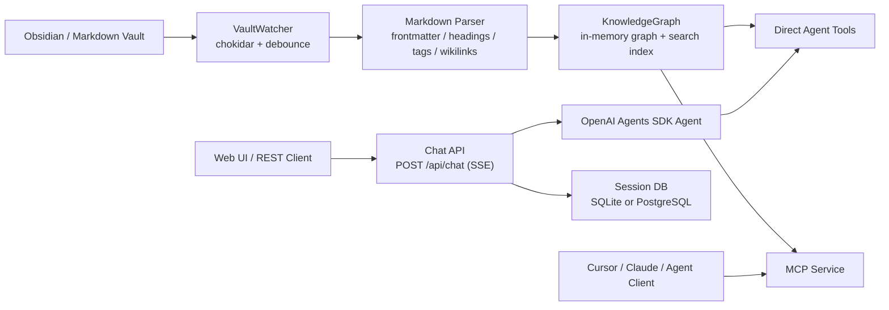
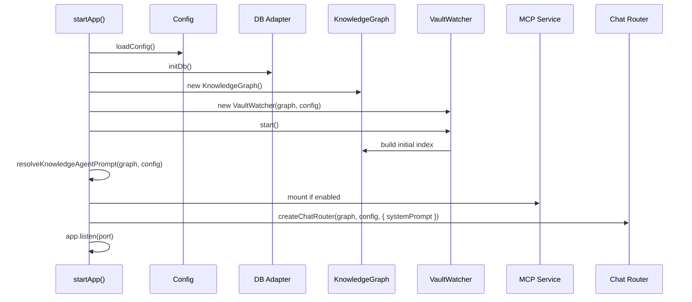

# 系统架构说明

本文档说明 `team-wiki` 当前版本的系统架构设计，重点覆盖：

- 核心组件与职责划分
- 启动流程与运行时数据流
- 知识图谱索引机制
- Chat / REST / MCP 的关系
- SQLite 与 PostgreSQL 在系统中的边界
- 当前实现的约束与后续演进方向

## 1. 架构目标

`team-wiki` 的目标不是做一个“只能离线搜索 Markdown”的小工具，而是把 Obsidian 风格知识库包装成一个可供团队使用的知识服务。

当前设计主要围绕下面几个目标展开：

1. 支持直接读取本地或挂载目录中的 Markdown 知识库
2. 将知识库索引为可查询、可遍历、可追踪链接关系的内存图谱
3. 同时提供三种使用方式：
   - Web UI 对话
   - REST API 接入
   - MCP Server 接入
4. 保持数据库边界清晰：
   - 知识图谱在内存中
   - 会话和消息持久化在数据库中
5. 允许按环境切换数据库后端：
   - `SQLite` 用于本地测试和小团队
   - `PostgreSQL` 用于多人长期运行

## 2. 总体架构



可以把它理解成两条主线：

1. `知识索引主线`：`Vault -> Watcher -> Parser -> KnowledgeGraph`
2. `对外服务主线`：`KnowledgeGraph -> Chat API / MCP -> Web UI 或外部 Agent`

## 3. 核心组件

### 3.1 KnowledgeGraph

代码位置：

- [team-wiki-server/src/graph/index.ts](/D:/WorkSpace/LLM-Wiki/team-wiki/team-wiki-server/src/graph/index.ts)

`KnowledgeGraph` 是系统核心。它负责把 Markdown 知识库组织成一个运行时内存图谱，主要包含：

- `nodes`：所有文档节点
- `resolvedLinks`：已解析的双链关系
- `unresolvedLinks`：未能解析的链接
- `backlinks`：反向链接索引
- `tagIndex`：标签索引
- `searchEngine`：全文检索索引

它不是数据库，也不是磁盘缓存，而是服务进程中的“实时知识视图”。

当前图谱支持的核心能力包括：

- 全文搜索
- 按标签搜索
- 读取单篇笔记
- 查看前向链接 / 反向链接
- 图遍历
- 最短路径分析
- 标签层级和图谱统计

### 3.2 VaultWatcher

代码位置：

- [team-wiki-server/src/watcher/index.ts](/D:/WorkSpace/LLM-Wiki/team-wiki/team-wiki-server/src/watcher/index.ts)

`VaultWatcher` 负责知识库目录的扫描、初始建索引，以及运行中的增量更新。

它的工作方式是：

1. 服务启动时递归扫描 `VAULT_PATH`
2. 只解析 `.md` 文件
3. 按并发限制解析 Markdown 元数据
4. 调用 `graph.build(...)` 建立完整图谱
5. 之后通过 `chokidar` 持续监听新增、修改、删除
6. 对同一路径做 debounce，避免批量变更时反复重建
7. 对单文件执行 `upsertFile()` / `removeFile()`

当前默认会忽略：

- 点目录 / 点文件
- `.obsidian/**`

因此它天然适合 Obsidian 仓库，但不依赖某个固定 vault 结构。

### 3.3 Markdown Parser

代码位置：

- [team-wiki-server/src/parser/index.ts](/D:/WorkSpace/LLM-Wiki/team-wiki/team-wiki-server/src/parser/index.ts)

解析器负责从 Markdown 中抽取结构化元数据，包括：

- frontmatter
- headings
- tags
- wikilinks
- 原始正文内容

这些解析结果不会直接暴露给用户，而是先进入 `KnowledgeGraph`，由图谱统一提供查询能力。

### 3.4 Agent 与进程内工具

代码位置：

- [team-wiki-server/src/agent/index.ts](/D:/WorkSpace/LLM-Wiki/team-wiki/team-wiki-server/src/agent/index.ts)
- [team-wiki-server/src/agent/tools.ts](/D:/WorkSpace/LLM-Wiki/team-wiki/team-wiki-server/src/agent/tools.ts)
- [team-wiki-server/src/agent/prompts.ts](/D:/WorkSpace/LLM-Wiki/team-wiki/team-wiki-server/src/agent/prompts.ts)

聊天问答不是直接把整个知识库塞进模型上下文，而是通过 `@openai/agents` 创建一个 Agent，再让 Agent 调用进程内工具访问知识图谱。

这层的关键设计是：

- Agent 内部直接调用本地工具
- 不经过 MCP HTTP 回环
- MCP 只作为外部客户端的接入协议

这让内部聊天链路更短，也更适合低延迟问答。

当前内置的知识工具包括：

- `search`
- `search_by_tags`
- `read_note`
- `get_forwardlinks`
- `get_backlinks`
- `get_neighbors`
- `traverse_graph`
- `shortest_path`
- `get_graph_stats`
- `list_notes`
- `get_tags`
- `get_tag_hierarchy`
- `get_index_status`

另外，当前 system prompt 机制已经改成：

- 有一个通用兜底默认 prompt
- 服务启动并完成初始索引后，基于当前 `VAULT_PATH` 生成动态上下文
- 支持通过配置文件或环境变量覆盖

详细说明见：

- [System Prompt 机制与使用](./system-prompt.md)

### 3.5 Chat API

代码位置：

- [team-wiki-server/src/chat/index.ts](/D:/WorkSpace/LLM-Wiki/team-wiki/team-wiki-server/src/chat/index.ts)

Chat API 是浏览器 UI 和自研应用对话时使用的主要入口：

- `POST /api/chat`

它的职责包括：

1. 接收用户消息和可选 `sessionId`
2. 从数据库读取已有会话历史
3. 创建 Knowledge Agent
4. 以流式模式运行 Agent
5. 将模型文本、思考片段、工具调用过程转成 SSE 事件返回
6. 把本轮用户消息和助手回复写回数据库

当前 SSE 事件主要包括：

- `text`
- `thought`
- `tool_start`
- `tool_end`
- `done`
- `error`

这里要注意一个边界：

- `知识检索` 依赖内存图谱
- `多轮会话` 依赖数据库

也就是说，数据库切换不会影响图谱查询能力，但会影响聊天会话的保存和恢复。

### 3.6 MCP Service

代码位置：

- [team-wiki-server/src/mcp/index.ts](/D:/WorkSpace/LLM-Wiki/team-wiki/team-wiki-server/src/mcp/index.ts)

MCP 服务面向 Cursor、Claude Desktop 或其他 Agent 客户端。

当前支持两套协议入口：

- 现代模式：`/mcp`
- 兼容旧客户端：`/sse` + `/messages`

MCP 暴露的是知识图谱工具，不是聊天 UI 那套会话式 assistant。

这意味着：

- MCP 客户端可以直接拿到搜索、读文、图遍历等能力
- 但聊天会话持久化主要还是在 REST Chat 侧

### 3.7 数据库适配层

代码位置：

- [team-wiki-server/src/db/index.ts](/D:/WorkSpace/LLM-Wiki/team-wiki/team-wiki-server/src/db/index.ts)
- [team-wiki-server/src/db/sessions.ts](/D:/WorkSpace/LLM-Wiki/team-wiki/team-wiki-server/src/db/sessions.ts)
- [team-wiki-server/src/db/postgres.ts](/D:/WorkSpace/LLM-Wiki/team-wiki/team-wiki-server/src/db/postgres.ts)

数据库层是一个典型的适配器设计：

- `initDb()` 根据配置选择 `SqliteAdapter` 或 `PostgresAdapter`
- 上层通过统一的 `sessions.ts` 访问会话数据
- Chat API 不需要关心底层到底是 SQLite 还是 PostgreSQL

当前数据库主要用于：

- 会话列表
- 消息历史
- 会话标题

当前数据库不负责：

- 存储知识图谱
- 存储 Markdown 正文索引
- 替代文件系统作为知识源

这个边界很重要，因为它意味着：

- `VAULT_PATH` 才是知识事实源
- 数据库只是对话与使用过程的持久化层

### 3.8 Web UI

代码位置：

- [team-wiki-vue-ui/src/views/ChatView.vue](/D:/WorkSpace/LLM-Wiki/team-wiki/team-wiki-vue-ui/src/views/ChatView.vue)

前端当前是一个独立的 Vue 3 应用，主要提供：

- 会话列表
- 新建 / 切换 / 删除会话
- 输入 Bearer Token / JWT
- SSE 流式展示回答
- 展示思考过程
- 展示工具调用过程
- Markdown 渲染

它当前通过 HTTP 调用后端接口，不依赖后端做 SSR，也不是嵌入式模板页面。

## 4. 启动流程

代码入口：

- [team-wiki-server/src/app.ts](/D:/WorkSpace/LLM-Wiki/team-wiki/team-wiki-server/src/app.ts)

服务启动顺序大致如下：



这个顺序有两个很关键的点：

1. 先建好知识图谱，再启动对外服务
2. system prompt 在初始索引完成后生成

所以当前服务不是“先启动空壳接口，再异步慢慢补索引”，而是尽量在对外可用前先把图谱准备好。

## 5. 运行时数据流

### 5.1 文档索引数据流

```text
Markdown file
  -> parse metadata
  -> normalize path
  -> add/update graph node
  -> resolve wikilinks
  -> rebuild backlinks/tag index/search index
```

首次启动时走“全量构建”，后续文件变化走“单文件增量更新”。

### 5.2 聊天请求数据流

```text
Web UI / Client
  -> POST /api/chat
  -> load session history from DB
  -> create Agent with system prompt + tools
  -> Agent calls KnowledgeGraph tools
  -> stream SSE response
  -> persist assistant message to DB
```

这里最重要的设计是：

- 模型不直接扫磁盘
- 模型也不直接访问数据库知识表
- 模型通过工具访问已经建立好的运行时图谱

### 5.3 MCP 请求数据流

```text
MCP Client
  -> /mcp or /sse
  -> MCP tool handler
  -> KnowledgeGraph method
  -> JSON/text result
```

MCP 更像“把知识图谱能力协议化对外输出”，而不是复用 Chat API。

## 6. 认证与访问控制

认证相关代码：

- [team-wiki-server/src/auth/index.ts](/D:/WorkSpace/LLM-Wiki/team-wiki/team-wiki-server/src/auth/index.ts)

当前系统支持：

- Bearer Token
- JWT

认证策略上有两个入口：

1. `/api` 路由使用一套认证中间件
2. MCP 路由内部也挂同一套认证逻辑

因此如果你配置了：

- `AUTH_TOKEN`
- 或 `JWT_SECRET`

那么 REST 与 MCP 都会受到保护。

当前“用户隔离”最明确的地方在会话层：

- 会话列表按 `userId` 读取
- 获取会话时会校验当前用户是否拥有该会话

而知识图谱本身是服务级共享的，不会按用户维护多份索引。

## 7. 数据存储边界

这是当前项目里最需要理解清楚的一条边界。

### 7.1 文件系统

文件系统中的 `VAULT_PATH` 是知识源头，负责提供：

- Markdown 原文
- 双链结构
- 标签和 frontmatter

### 7.2 内存图谱

`KnowledgeGraph` 是运行时查询层，负责提供：

- 搜索
- 链接关系
- 图遍历
- 工具调用上下文

### 7.3 数据库

数据库是持久化层，负责提供：

- 聊天会话
- 历史消息
- 标题等元信息

### 7.4 模型

模型层负责：

- 根据 system prompt 和用户问题组织检索步骤
- 调用工具
- 汇总答案
- 尽量给出来源和证据边界

这四层分开以后，系统的可演进性会好很多：

- 想换数据库，不需要改图谱结构
- 想换 vault，不需要改数据库 schema
- 想换模型或 prompt，不需要改知识文件组织方式

## 8. SQLite 与 PostgreSQL 的定位

### SQLite

推荐场景：

- 本机开发
- POC / 验证
- 少量用户
- 单机部署

优点：

- 零外部依赖
- 启动快
- 迁移成本低

限制：

- 更适合轻量并发
- 备份、连接治理、独立运维能力较弱

### PostgreSQL

推荐场景：

- 50 人以上团队日常使用
- 长期运行
- 需要更稳定的并发和备份能力

优点：

- 更适合多人共享
- 连接池、备份、监控、运维体系更成熟

限制：

- 需要独立数据库服务
- 部署和维护成本高于 SQLite

当前架构下，两者只影响“会话持久化层”，不影响知识图谱索引主链路。

## 9. 当前实现特点与约束

### 9.1 优点

- 架构边界清晰
- `VAULT_PATH` 可切换，不绑定固定知识库结构
- Agent 内部不绕 MCP，聊天链路较短
- 同时兼容 Web UI、REST、MCP 三种使用方式
- 数据库后端可以按环境切换

### 9.2 当前约束

1. 知识图谱是单进程内存态
2. 服务重启后需要重新建立图谱
3. system prompt 当前在启动时生成一次，不会随目录结构变化自动热刷新
4. 数据库目前不承载知识索引，只承载会话
5. 当前更偏向单实例服务，不是多实例共享图谱架构

## 10. 后续可演进方向

如果后面继续往团队化和生产化推进，比较自然的方向有：

1. 增加图谱快照或增量缓存机制，缩短重启后的冷启动时间
2. 支持 system prompt 热刷新或按 vault 变化重建
3. 增加后台管理能力，例如索引状态、最近变更、重建索引入口
4. 在 PostgreSQL 方案下补更完整的运维文档和监控建议
5. 如果未来有多实例需求，再考虑把知识索引从单进程内存态升级为共享索引服务

## 11. 一句话总结

`team-wiki` 当前架构的核心思想是：

**用文件系统承载知识源，用内存图谱承载检索能力，用数据库承载会话持久化，再通过 REST / Web UI / MCP 把这些能力暴露给团队和 Agent。**
